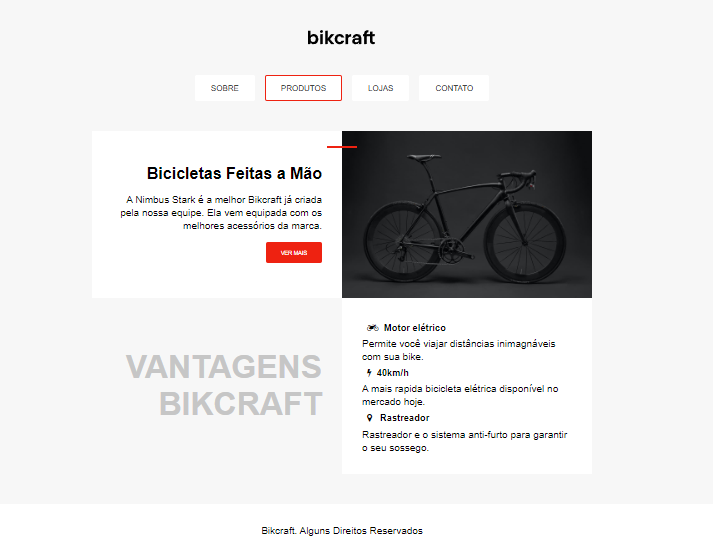

# Bikcraft

Este é um site simples para exibir informações sobre a Bikcraft, uma marca que oferece bicicletas feitas à mão e equipadas com os melhores acessórios e funcionalidades.

### Descrição

O projeto Bikcraft apresenta as bicicletas exclusivas da marca, destacando seus diferenciais e vantagens, como motor elétrico, alta velocidade e rastreador anti-furto. O site é composto por uma interface de navegação intuitiva, que permite ao usuário acessar informações sobre a empresa, seus produtos, lojas e contato.

### Tecnologias Utilizadas

HTML5: Estrutura do conteúdo do site.
CSS3: Para estilização do layout e design da página.
Font Awesome: Usada para ícones representando as vantagens da bicicleta.

**_Entre em contato comigo_**

- **E-mail**: [izabelle.alvesbl@gmail.com](mailto:izabelle.alvesbl@gmail.com)
- **LinkedIn**: [Izabelle Alves](https://www.linkedin.com/in/izabellealvess/)
